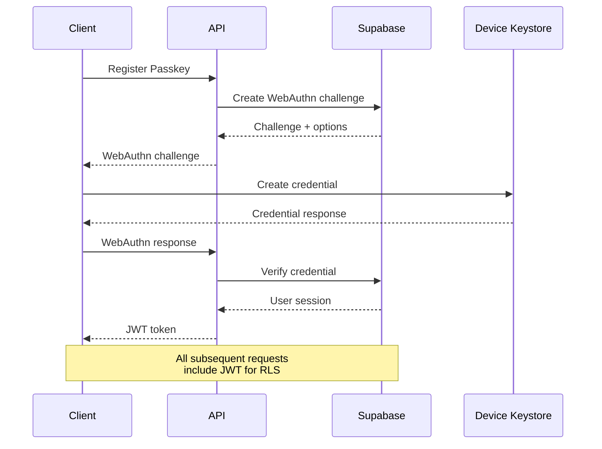

# Backend Architecture

## Service Architecture (Next.js API Routes)

**Controller Organization:**

```
apps/api/src/pages/api/
├── auth/
│   ├── passkey-register.ts    # WebAuthn registration
│   ├── passkey-verify.ts      # WebAuthn authentication
│   └── recovery-validate.ts   # Recovery phrase validation
├── cycle-data/
│   ├── index.ts              # CRUD with optimistic concurrency
│   ├── sync.ts               # Batch sync operations
│   └── conflict-resolve.ts   # Conflict resolution helpers
├── healthcare/
│   ├── create-share.ts       # Encrypted share link creation
│   ├── validate-token.ts     # Secure token validation (calls RPC)
│   ├── upload-report.ts      # Encrypted report upload
│   └── download/[...params].ts # Signed URL generation
├── privacy/
│   ├── user-prefs.ts         # Encrypted user preferences
│   └── emergency-wipe.ts     # Duress data deletion
└── internal/
    ├── rpc-proxy.ts          # Secure RPC function proxy
    └── health-check.ts       # System health validation
```

## Database Architecture (Complete RLS + RPC)

**Data Access Layer (Secure RPC):**

```typescript
// Repository pattern with RLS enforcement
class CycleDataRepository {
  constructor(private supabase: SupabaseClient) {}

  async updateWithOptimisticConcurrency(
    recordId: string,
    encryptedPayload: string,
    cryptoEnvelope: CryptoEnvelope,
    currentVersion: number,
    deviceIdHash: string
  ): Promise<UpdateResult> {
    const { data, error } = await this.supabase.rpc(
      'update_cycle_data_optimistic',
      {
        record_id: recordId,
        new_payload: encryptedPayload,
        new_envelope: cryptoEnvelope,
        current_version: currentVersion,
        device_hash: deviceIdHash,
      }
    );

    if (error) {
      throw new DatabaseError('Failed to update cycle data', error);
    }

    return data;
  }
}
```

## Authentication and Authorization (Passkeys + RLS)

**Auth Flow:**


