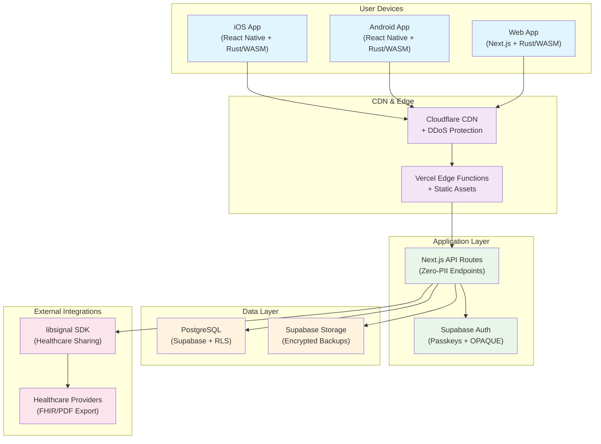

# High Level Architecture

## Technical Summary

Aura, zero-knowledge client-first architecture ile Rust/WASM cryptographic core üzerine inşa edilmiş privacy-first menstrual tracking uygulamasıdır. Supabase managed PostgreSQL Row Level Security ve libsignal protokolü kullanarak healthcare provider'larla güvenli paylaşım sağlar. Cross-platform React Native/Next.js frontend ile monorepo yapısında organize edilmiş, offline-first functionality ve cultural stealth mode capabilities sunar.

## Platform and Infrastructure Choice

**Platform Analysis:**

**Option 1: Vercel + Supabase + Cloudflare (RECOMMENDED)**

- **Pros:** Zero-config deployment, edge computing, excellent DX, strong security defaults
- **Cons:** Vendor lock-in, limited backend customization for complex crypto operations
- **Use Case Fit:** Ideal for privacy-first apps with client-side crypto, excellent compliance features

**Option 2: AWS Full Stack (Lambda + RDS + Cognito)**

- **Pros:** Complete control, enterprise compliance, mature crypto services
- **Cons:** Complex setup, higher costs, over-engineered for MVP scope
- **Use Case Fit:** Better for enterprise scale but overkill for current requirements

**Option 3: Self-Hosted Infrastructure**

- **Pros:** Complete control, no vendor dependencies, audit transparency
- **Cons:** High operational overhead, security responsibility, slower iteration
- **Use Case Fit:** Suitable for paranoid privacy but slows development velocity

**Recommendation:** Vercel + Supabase + Cloudflare combination provides optimal balance of privacy control, developer experience, and compliance capabilities required for zero-knowledge reproductive health app.

**Platform:** Vercel (frontend) + Supabase (backend) + Cloudflare (CDN/Security)
**Key Services:** Supabase Auth, PostgreSQL with RLS, Edge Functions, Vercel Serverless Functions, Cloudflare Workers
**Deployment Host and Regions:** Multi-region (US-East, EU-West, Asia-Pacific) with data residency controls

## Repository Structure

**Structure:** Monorepo with domain-driven organization
**Monorepo Tool:** Nx Workspace with pnpm package manager
**Package Organization:** Apps (mobile, web), packages (shared-crypto, shared-types, ui-components), infrastructure (deployment configs)

Rationale: Monorepo enables shared cryptographic types and security policies across platforms while maintaining independent deployment capabilities. Nx provides excellent build caching and dependency management for complex crypto builds.

## High Level Architecture Diagram

## Architectural Patterns

- **Zero-Knowledge Architecture:** Client-side encryption with server never accessing plaintext data - _Rationale:_ Fundamental privacy requirement for reproductive health data protection
- **Offline-First Pattern:** Local data primary with optional encrypted sync - _Rationale:_ Ensures functionality without network dependency, critical for privacy-conscious users
- **Layered Security Pattern:** Defense-in-depth with encryption at rest, transit, and application layer - _Rationale:_ Reproductive health data requires maximum protection against various attack vectors
- **Event Sourcing for Audit:** Immutable audit trail for healthcare sharing activities - _Rationale:_ Medical data sharing requires complete auditability for compliance and user trust
- **Cultural Adaptation Pattern:** UI/UX adapts to cultural privacy requirements with stealth modes - _Rationale:_ Reproductive health stigma varies dramatically across cultures requiring adaptive interfaces
- **Privacy-Adaptive Accessibility:** Screen reader and assistive technology support that maintains stealth mode integrity - _Rationale:_ Accessibility must not compromise user privacy in sensitive cultural contexts
