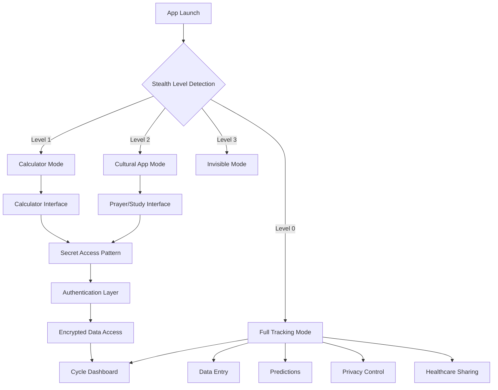
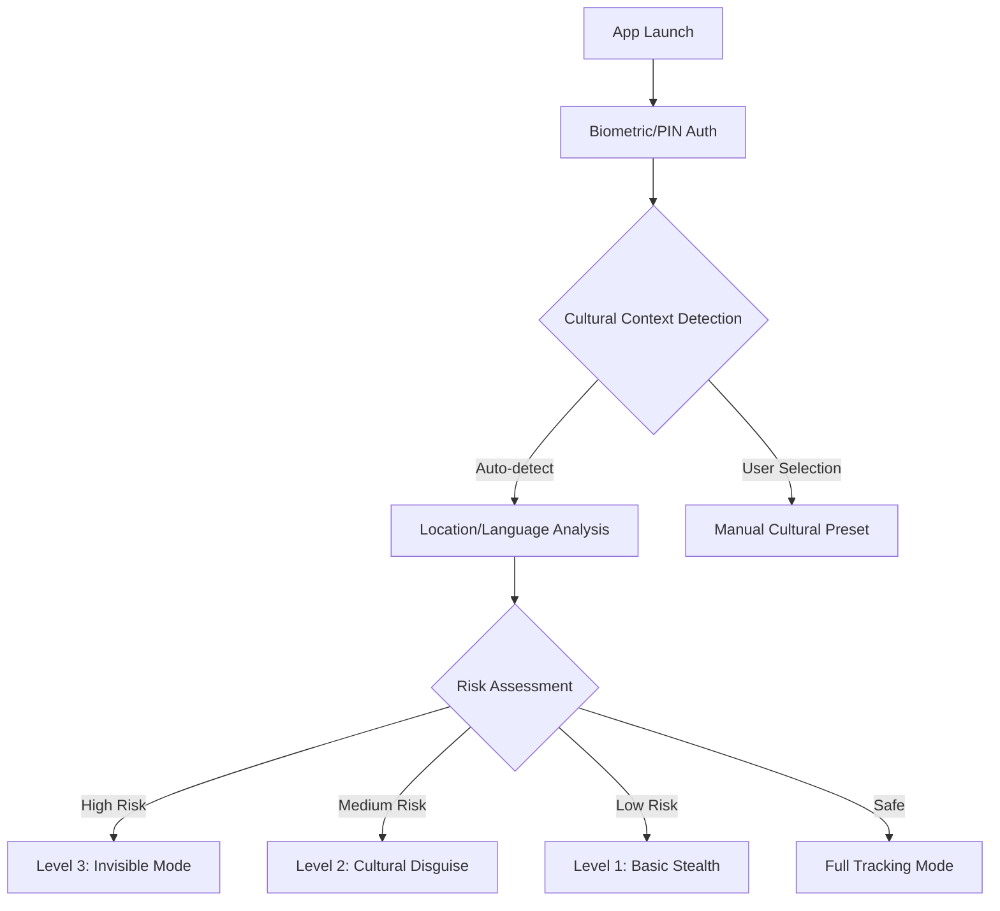
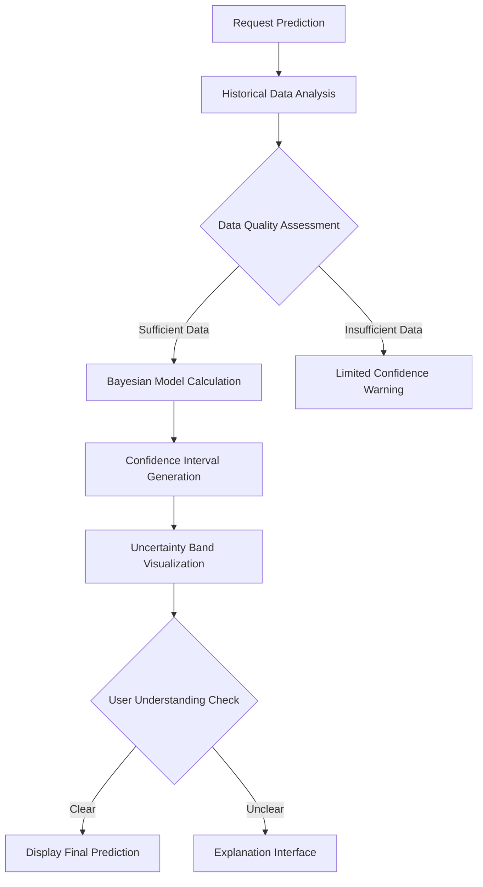

# UX Architecture & User Experience Design

## Overall UX Goals & Principles

### Target User Personas

**Privacy-Conscious Tracker:** Reproductive health data security concerns, seeking zero-knowledge architecture

**Cultural Stealth-Mode User:** High menstrual stigma cultures requiring complete invisibility, needing positive disguise (religious app, study app)

**Workplace Privacy User:** Medium stigma cultures requiring discrete tracking in professional environments

**Healthcare Collaborator:** Secure data sharing with medical consultation, potentially requiring cultural mediators

**Uncertainty-Aware User:** Preferring honest uncertainty over false precision, science-based approach

### Usability Goals

- **Privacy Control:** Users can make all data sharing decisions within 30 seconds and manage them effectively
- **Stealth Efficiency:** Stealth mode transitions complete in under 2 seconds with completely natural appearance
- **Honest Predictions:** Users understand prediction confidence with 95% accuracy
- **Security Awareness:** Users clearly comprehend zero-knowledge architecture benefits

### Design Principles

1. **Privacy as Cultural Control** - Every interface decision prioritizes user agency over data collection, adapted to cultural context
2. **Honest Uncertainty** - Transparent uncertainty builds trust instead of false precision, using cultural terminology
3. **Adaptive Cultural Discretion** - Interface transforms from complete invisibility to comprehensive tracking based on regional stigma levels
4. **Zero-Knowledge by Design** - No UI element exposes cultural context or user data to server
5. **Authentic Cultural Stealth** - Disguise modes appear not just functional but culturally appropriate and authentic

## Information Architecture (IA)

### Site Map / Screen Inventory

### Navigation Structure

**Primary Navigation:** Context-aware navigation adapting to current privacy mode - hidden in stealth modes, bottom tab navigation in full mode

**Secondary Navigation:** Quick-access privacy controls always available through gesture-based shortcuts, cultural preset switching

**Breadcrumb Strategy:** Zero-breadcrumb approach in stealth modes, minimal breadcrumbs in full mode to prevent navigation history exposure

## User Flows

### Flow 1: Stealth Mode Activation and Cultural Adaptation

**User Goal:** Activate appropriate stealth level for safe tracking in current environment

**Entry Points:** App launch, privacy emergency, cultural context change

**Success Criteria:** Authentic disguise activation within 2 seconds, zero trace of original app purpose

**Edge Cases & Error Handling:**

- Emergency stealth activation (panic gesture) bypasses all menus, immediate disguise
- Failed biometric auth triggers decoy mode with false data
- Network detection of unusual patterns triggers automatic stealth elevation
- Battery-saving mode prioritizes stealth over functionality

### Flow 2: Uncertainty-Based Cycle Prediction

**User Goal:** Obtain reliable cycle predictions with clear confidence levels

**Entry Points:** Dashboard, prediction screen, data entry completion

**Success Criteria:** User understands prediction confidence with 95% accuracy, sufficient context for decision-making

### Flow 3: Healthcare Provider Data Sharing

**User Goal:** Securely share selective menstrual data with healthcare provider

**Entry Points:** Healthcare sharing section, medical appointment preparation

**Success Criteria:** User knows exactly what data will be shared, provider has secure access, automatic expiration works
